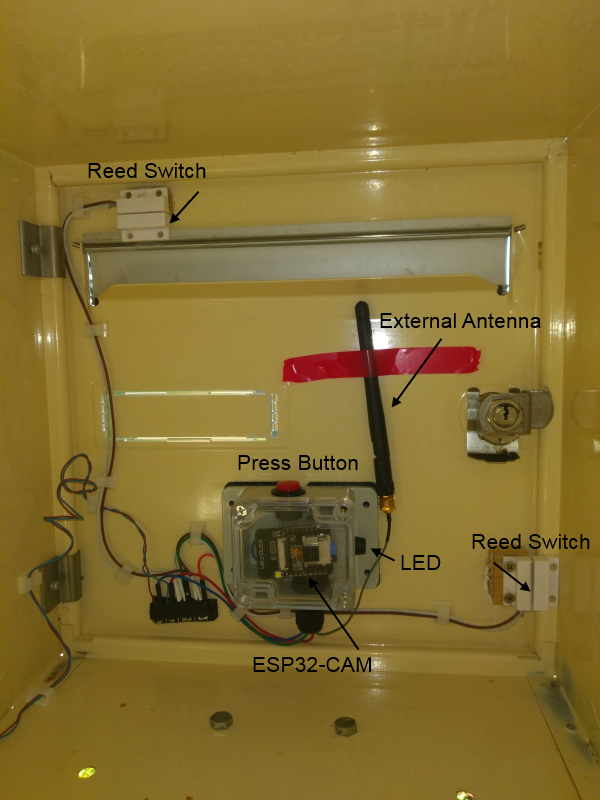
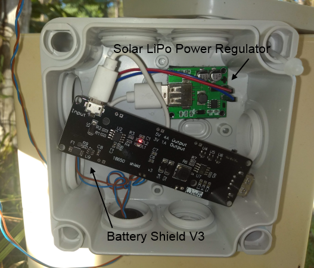
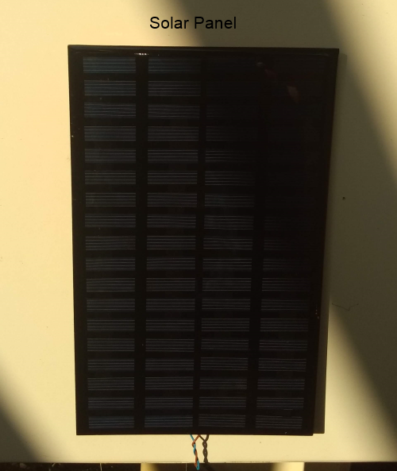

# ESP32-CAM - Mailbox Notifier

Mailbox Notifier is an autonomous system based on an ESP32 CAM that can take a picture from inside your mailbox when your have received a letter or parcel and send an email via Gmail APIs with the picture in attachment at a email address of your convenience.

This project uses an ESP32 CAM Dev Board from AI Thinker with an OV2640 2MP Camera.
I will not expose how to use a NodeMCU in this article, there are plenty of [tutorials](https://randomnerdtutorials.com/esp32-cam-video-streaming-face-recognition-arduino-ide/) and blogs about this topic on Internet.

**µc**: microcontroller

## Table of contents
- [ESP32-CAM - Mailbox Notifier](#esp32-cam---mailbox-notifier)
  * [Table of contents](#table-of-contents)
  * [Electronic materials](#electronic-materials)
  * [Prerequisites](#prerequisites)
    + [SD Card](#sd-card)
      - [Format](#format)
      - [Directory tree](#directory-tree)
    + [Configuration File](#configuration-file)
      - [WiFi](#wifi)
      - [Gmail Credentials](#gmail-credentials)
      - [Email settings](#email-settings)
      - [SMS Settings](#sms-settings)
      - [Control](#control)
    + [External antenna](#external-antenna)
  * [How does it work ?](#how-does-it-work-)
    + [Boot](#boot)
    + [Fetch mail](#fetch-mail)
    + [You have got mail](#you-have-got-mail)
  * [Go further](#go-further)
    + [JSON Config file on SD Card](#json-config-file-on-sd-card)
    + [OTA - Over The Air](#ota---over-the-air)
    + [Gmail API](#gmail-api)
      - [Retrieve an Access Token](#retrieve-an-access-token)
      - [Send an email with attachment](#send-an-email-with-attachment)
    + [Power Consumption](#power-consumption)
    + [SD Card in 1-bit SD mode](#sd-card-in-1-bit-sd-mode)
    + [WiFi](#wifi-1)
      - [Power saving](#power-saving)
      - [Static IP Address](#static-ip-address)
    + [Camera OV2640](#camera-ov2640)
  * [Gallery](#gallery)
    + [Inside the Box](#inside-the-box)
    + [Power Supply](#power-supply)
    + [Solar Panel](#solar-panel)

## Electronic materials

- [ESP32 CAM AI Thinker](https://randomnerdtutorials.com/esp32-cam-ai-thinker-pinout/) with an **OV2640 Camera** :

  - Using an [external antenna](https://randomnerdtutorials.com/esp32-cam-connect-external-antenna/) can widely improve the WiFi signal
  
- Micro SD Card with a tiny capacity (4Go) :

  - It is used to store the settings configuration of the system like WiFi configuration, Gmail Credentials, recipient's email and the ability to personalize your message.
  - The program uses also the SD Card to store the picture in order to send it through Gmail API of Google

- Reed Switch (**GPIO12**) :

  - It is used to wake up the ESP32 and detect the opening door. I use it because it is totally resistant to moisture, guaranteeing greater durability

- Press Button (**GPIO16**) and LED (**GPIO13**) :

  - I use it to notify the program that I am picking up my mail and thus avoid wasting battery energy by sending useless notification

- LED (**GPIO13**) :

  - The LED is blinking when the order from the Press Button is operated. The visual signal notifies the operator that his order has been taken into account by the µc.      

- Battery 18650-30Q **3000 mAh** :

  - The system can be kept alive **more than two weeks without external energy** and send more than twenty notifications via WiFi

- Solar Panel, Solar LiPo Power Regulator and Battery Shield **V3** :

  - The combination of these parts allows to recharge the battery

  > The system can be kept alive over ten days with a single battery, if your want to extend this period I advise you to use two batteries thanks to a Shield V8. It can be interesting if you live in area not too sunny
  
  Have a look on the electronic schematic on this link :  [Mailbox Notifier Electronic Diagram](docs/mailbox_ESP32CAM_AI_THINKER_v2.pdf)

## Prerequisites

### SD Card

#### Format

The SD Card should be formated in **FAT 32**.

#### Directory tree

The SD Card must have a directory tree like below : 

```
.
├── mailbox.cfg (Configuration file)
├── /camera (The pictures are saved here)
├── /firmware (The binary code .bin must be saved here with the file name mailbox.bin)
└── /tmp (Workspace to convert the picture in base64 format)
```

### Configuration File

The program uses the [ArduinoJSON](https://arduinojson.org/v6/api/) library to parse the config file: **mailbox.cfg**

> [**Warning**] the file must be in UTF-8 without BOM Header. Otherwise the ArduinoJSON library fails.

> [**Info**] The Arduino SD Library has some limitations with FAT files. [You must use the *8.3 filename* convention](https://www.arduino.cc/en/Reference/SDCardNotes#toc4).

You can retrieve an [mailbox.cfg](https://github.com/vhuynen/ESP32-CAM-Mailbox-Notifier/blob/master/source/ESP32/mailbox.cfg) config file example in this project's repository. You will have to save the config file at the root of the SD Card.

#### WiFi

It is possible to use a Static IP for your device. It is useful to avoid to exchanging useless DHCP frames in order to optimize the battery life. If you don't, the device will use DHCP Protocol to retrieve an IP Address.

In all cases, you will have to fill the **ssid** and **security_code** of your WiFi.

```c
"wifi" :{
	// Size max :30
	"ip_static" : "192.168.5.141",
	// Size max :30 - mandatory if ip_static attribut
	"gateway" : "192.168.5.1",
	// Size max :30  - mandatory if ip_static attribut
	"subnet" : "255.255.255.0",
	// Size max :30	  - mandatory if ip_static attribut
	"dns_ip_primary" : "192.168.5.1",
	// Size max :30 - mandatory if ip_static attribut. Can be the same that dns_ip_primary attribute.
	"dns_ip_secondary" : "192.168.5.1",
	// Size max : 50 - mandatory
	"ssid":"Your WIFi SSID",
	// Size max : 50 - mandatory
	"security_code":"Your Code"
}
```

#### Gmail Credentials

In order to use Gmail RESTful API and to retrieve your credentials, you will have to set a new project in your GCP (Google Cloud Platform) account. You can follow all steps in this article : [How to retrieve a Refresh Token via Google Cloud Platform ?](https://github.com/vhuynen/GCP-Retreive-Offline-Refresh-Token/blob/master/README.md)  After that, you will have to fill in all attributes below.

```c
"gmail_credentials" : {
	// Size max : 150
	"refresh_token":"OAuth Refresh Token retrieved for your Application Google Cloud Platform. One scope : https://www.googleapis.com/auth/gmail.send",
	// Size max : 100
	"client_id":"You Client Id from your Web Application",
	// Size max : 50
	"client_secret":"Your Client Secret from your Web Application"
}
```

#### Email settings

You will have to fill in your own email address in the attribute **from**. The same account for which you have retrieved credentials from your own application from GCP . Cf. previous section.

You can fill as many email addresses you want to notify thanks to the comma separator into the attribute **to**.

Finally, you can personalize your **subject** and **body** message.

> For the **body_door** you will use the escape character **\n** to print a newline character.


```c
"email" : {
	// Size max : 50
	"from":"vincent.huynen@gmail.com",
	// Size max : 100
    // "to":"vincent.huynen@gmail.com,huynen@gmail.com" Can be a list of mail addresses separator : ,
	"to":"vincent.huynen@gmail.com",
	// Size max : 100
	"subject_door":"[Mailbox] You have got mail !",
	// Size max : 150
	"body_door":"You have probably received something today.\nHave a nice Day !"
}
```

#### SMS Settings

This section is useful only for [Free](https://en.wikipedia.org/wiki/Free_(ISP)) mobile customers.  Indeed, this provider (mine) provides a free and straightforward API to send SMS with a simple GET verb.

> You can skip this section or better adapt code with a free SMS provider and I will be delighted to integrate your Pull Request.

```c
"sms" : {
    // Can be a list of URLs with comma separator.
	"url" : "https://smsapi.free-mobile.fr/sendmsg?user=<Your Client ID>&pass=<Your API Key>&msg=",
	"body_door" : "[Mailbox] You have got mail\nHave a Nice day !"
}
```

#### Control

The attribute **overtime_open_door** is the timeout in **millisecond** that throws an exception if the door is always opened after the countdown. The countdown is triggered on boot or when the door has just been opened.

Attribut **flashlight_intensity** :

- **0** : the flashlight is **off**
- **1** : the flashlight is **high**
- **2** to **100** : Thanks to a PWM (**P**ulse **W**idth Modulation) signal, you can set the flashlight intensity at your convenience. 

```c
"control" : {
	// Size max : 10
	"overtime_open_door" : "20000",
	// Flashlight Intensity: 0 (Flashlight Off) / 1 (High intensity) / 2 to 100 (PWM scale intensity)
	"flashlight_intensity" : "12"    
}
```

### External antenna

The biggest challenge is getting WiFi to connect to your router from inside a metal mailbox. If the signal is insufficient from inside the mailbox, you may have to use an external WiFi antenna. The module ESPCAM-32 is outfitted with a U.FL connector just under the PCB antenna.

If you want to use an external antenna, you must unsolder the resistor just near the U.FL connector so as to desactivate the PCB antenna and solder a tin link just under the resistor removed in order to activate the external antenna. [Read this tutorial to understand what I am talking about](https://randomnerdtutorials.com/esp32-cam-connect-external-antenna/).

## How does it work ?

The logic of the **loop()** function has 3 parts : 

- **Boot** : when you reset or switch on the µc

- **Fetch mail** : when you pick up your mail and you don't want to be notified by the µc

- **You have got mail** : the µc sends a mail notification with a photo in attachment

  > The µc sends an error message by email if the door has been left open too long and enters in deep sleep mode in order to save power consumption. You will have to restart the µc to reinitialize it.
  >
  > In any case, if the µc can't reach the WiFi signal or if your Internet connection is down, the µc stops the program and goes to deep sleep mode until the next wake up interrupt.

### Boot

When the system is booting after a reset or a restart, the µc launches the countdown of the timeout.

If the door is closed before the timeout then the µc configures the reed switch as an external wakeup and goes to deep sleep mode. 

If the door is always opened after the timeout, the µc sends an email with an error message :

*Doors have been opened too long when you have turned on the ESP32-CAM.*
*Reboot the ESP32-CAM to reinitialize it !*

After that, the µc is going to deep sleep without external interrupt. You will have to restart the µc to re-initialize it.

### Fetch mail

You do not want to receive notifications when you fetch your mail. 

For this purpose, you will have to press the "press button" to notify the µc that you pick up your mail.  The LED is blinking when the order from the Press Button is operated. The visual signal notifies the operator that his order has been taken into account by the µc.

Thus, the controller that has been woken up wait for the closing door till the timeout. When the door is closed the LED is turned-off and the module is going to deep sleep mode.

If the timeout is reached before the closing then the program sends an error message :

*Doors have been opened too long when you have fetched your mail.*
*Reboot the ESP32-CAM to re-initialize it !*

After that, the µc is going to deep sleep without external interrupt. You will have to restart the µc to re-initialize it.

### You have got mail

The delivery man or the postman comes and opens the door. The reed switch signal wakes up the µc.

If the door is closed before the timeout then the program takes a picture from inside the mailbox, sends an email with the photo in attachment. After that, the µc configures the reed switch as an external wakeup and goes in deep sleep mode. 

If the door is always opened after the timeout, the program sends an email with an error message :

*Doors have been opened too long by the postman.*
*Reboot the ESP32-CAM to reinitialize it !*

After that, the µc is going to deep sleep without external interrupt. You will have to restart the µc to re-initialize it.

## Go further 

The program has enough comments to understand the principal functions. But I want to review some interesting features that this program implements.

### JSON Config file on SD Card

In order to use this program out of the box, I have externalized all properties in a JSON configuration file that is stored at the root of the SD Card.

The program uses the [ArduinoJSON](https://arduinojson.org/v6/api/) library to deserialize `SDCard.getJSonFromFile` the attributes from the configuration file and initialize `SDCard.initProperties` the variables.

### OTA - Over The Air

In the same idea, I would have liked that the µc boots the first time with the binary program directly from the SDCard **/firmware/maibox.bin** rather than the [FDTI](https://en.wikipedia.org/wiki/FTDI).  This functionality works fine with an **ESP32 DEV KIT V1** but I have some trouble with the **NodeMCU ESP32 Wrover**. Get in touch if you have an idea of what is going wrong... Cf. function `updateFirmware` called in the `setup` function of the main program `ESP32CAM.ino`

> This feature can be interesting in order to fix bug or upgrade.

### Gmail API

Rather than use SMTP Protocol to send email, I decided to use Gmail API for two reasons :

- Using my own Google account rather than creating a new Google account for this purpose
- I don't want to store my Login/Password of my Google account in an insecure device (In my letterbox)

> And today everything is API isn't it !

#### Retrieve an Access Token

In order to call the Gmail API to send an email, you first need to retrieve an Access Token from your **offline Refresh Token** that you have retrieved in the section [gmail credential](#gmail-credentials). 

Then, you can call the Gmail API with the Access Token in the "Authorization" request header field in order to use the "Bearer" authentication scheme to transmit the Access Token. 

> A best practice is using the Access Token until it will be expired. In our case, it is unlikely that the program will need to reuse the token before 3600 seconds.
>
> It is the reason why the program retrieves a fresh Access Token for each Gmail API call.
>
> Cf. file `GmailAPI.ino` function `retrieved_access_token_gmail`

#### Send an email with attachment

This function is implemented in the file  `GmailAPI.ino` method `sendMail` with the `pathFile` in the method signature.

The POST Request has been entirely composed manually as specified in the Google API specification [Uploading Attachments](https://developers.google.com/gmail/api/guides/uploads) . The main difficulty was to define the total `Content-Length` of the Request while taking into account the content of the picture which has been transcoded in Base64 before.

The trick is to use the SD Card to transcode the picture in Base64 and to retrieve the output file size. No concerns about memory consumption of the µc. The program can send the content of the attachment by chunks as long as there are contents to send from the SD Card.
I have benched my program and I can send more than 10 Mo in attachment... this takes a while about ten minutes but it works !

In my case, the picture weighs roughly 150 Ko and the µc takes at less 15 seconds to do this.
It's widely efficient for my project.

### Power Consumption

In all autonomous and self-sufficient IoT projects, you will have to think "low power consumption" in your design.

In my project, I use a camera and a flash (LED built-in of the ESP32-CAM) to take a picture in the dark of my letterbox, the WiFi to send data through Internet. These features are very power consuming but in a very short time frame in my case.

It's the reason why I choose to use the [deep sleep mode](https://lastminuteengineers.com/esp32-sleep-modes-power-consumption/) between two interrupts. Theoretically, the µc alone consumes 10 µA in deep sleep mode, in my case the ESP32-CAM consumes **5 mA** in real measure in deep sleep mode.

When the system is woken up and do all tasks I have recorded a spike of **300 mA** without the flash. Thus, with a battery **18650-30Q** with a capacity of **3000 mAh** the system can be self-sufficient **more than three weeks**. 

<u>Hypothesis</u> :

- 5 alerts a week that take 60 sec. by the µc  : 
  - 5 * 3 weeks * 300 mA * 60 sec. =  270 000 / 3 600 sec. = 75 mAh
  - On the assumption that the flash consumes also 75 mAh on the same period. The flash lasts only one second. 
- Number of theoretical hours in deep sleep mode with a battery of 3000 mAh
  - (3000 mA - 150 mA)  / 5 mA = 570 hours 
  - 570 hours  / 24 hours per day = **~24 days**

> In real-life the system can be auto-powered for 15 days.

To go further about how to use the [deep sleep mode](https://docs.espressif.com/projects/esp-idf/en/latest/esp32/api-reference/system/sleep_modes.html#external-wakeup-ext0) in this program see file `Utils.ino` function `goToDeepSleep()`

### SD Card in 1-bit SD mode

One of the problem of the ESP32-CAM is there are not enough free GPIO because the camera and the SD Card need to many of them.  You can rapidly understand that the constructor has left GPIOs with particular behavior as [GPIO 0](https://randomnerdtutorials.com/esp32-pinout-reference-gpios/) on boot, [GPIO 13](https://docs.espressif.com/projects/esp-idf/en/latest/esp32/api-reference/peripherals/sd_pullup_requirements.html#pull-up-conflicts-on-gpio13) with pull-up conflicts and [GPIO 4](https://randomnerdtutorials.com/esp32-cam-ai-thinker-pinout/) shared with the flashlight.  

> [**INFO**] Only GPIOs which have RTC functionality can be used as source wakeup: 0,2,4,12-15,25-27,32-39.

In my case, I have needed to use one **RTC GPIO** so as to set an interrupt. Only the GPIO 12 seems possible but it is natively used by the SD Card.

The trick is to activate the SD Card in **1-bit SD mode** in order to free the GPIO 12, the read/write is somehow less efficient but sufficient for this project  :

```c
  // Initialize SD library 1 bit
  while (!SD_MMC.begin("/sdcard", true)) {
    Serial.println(F("Failed to initialize SD library"));
    delay(1000);
  }
```

### WiFi

#### Power saving

If the WiFi is not reachable or if the router is not capable to deliver an session to the device then it is useless to go further. Thus, always of power saving concerns, the device will go to in deep sleep mode until the next wake up.

```c
  // Keep track of when we started our attempt to get a  connection
  unsigned long startAttemptTime = millis();

  // Keep looping while we're not connected AND haven't reached the timeout
  while (WiFi.status() != WL_CONNECTED && millis() - startAttemptTime < wifi_timeout) {
    delay(10);
  }

  // Make sure that we're actually connected, otherwise go to deep sleep
  if (WiFi.status() != WL_CONNECTED) {
    Serial.println("FAILED");
    goToDeepSleep();
  }  
```

#### Static IP Address

A best practice is to set a Static IP Address to your device. Of course, depending on your network setup this may not be a practical solution, but if your goal is to reduce the power consumption as far as we can go, it’s worth looking at this as well.

For this purpose, it has been necessary to create a function to instantiate an `IPAddress` class from the Static IP addresses from the mailbox.cfg JSON file. Indeed, the function `IPAddress.fromString()` doesn't work with the IDE Arduino.

```c
// Compose IP Address from properties
IPAddress getIPAddressFromString(char* ipStr) {
  int part_1;
  int part_2;
  int part_3;
  int part_4;

  char* ip_cpy = (char *) malloc(15);
  strcpy(ip_cpy, ipStr);
  char * ip_tokenizer = strtok(ip_cpy, ".");
  int count = 1;
  while ( ip_tokenizer != NULL ) {
    if (count == 1) {
      part_1 = atoi(ip_tokenizer);
    }
    if (count == 2) {
      part_2 = atoi(ip_tokenizer);
    }
    if (count == 3) {
      part_3 = atoi(ip_tokenizer);
    }
    if (count == 4) {
      part_4 = atoi(ip_tokenizer);
    }
    ip_tokenizer = strtok(NULL, ".");
    count++;
  }
  return IPAddress(part_1, part_2, part_3, part_4);
}
```

 

### Camera OV2640 

To take a photo with the camera, I have followed this [tutorial](https://randomnerdtutorials.com/esp32-cam-take-photo-save-microsd-card/). I did not have any problems with the camera setup. I have simply adapted the code from this tutorial for my need.
In order to verify the normal operation of your camera's probe, I advise you to test it with the schetch : `Example > ESP32 > Camera > CameraWebServer ` or to follow this [tutorial](https://randomnerdtutorials.com/esp32-cam-video-streaming-face-recognition-arduino-ide/).

> It's too bad that it's not possible to set the camera to rotate the picture according to the position of the camera.

## Gallery

### Inside the Box



### Power Supply



### Solar Panel




So please feel free to give me your feedback and improvement !